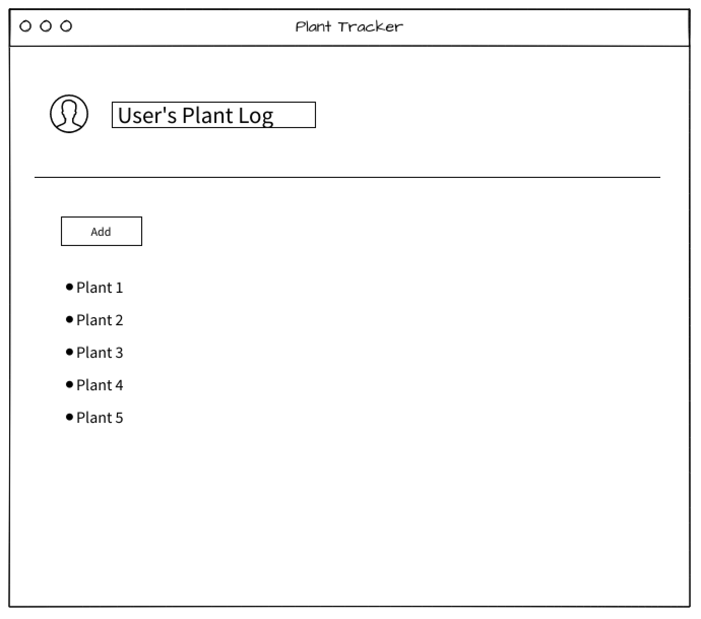
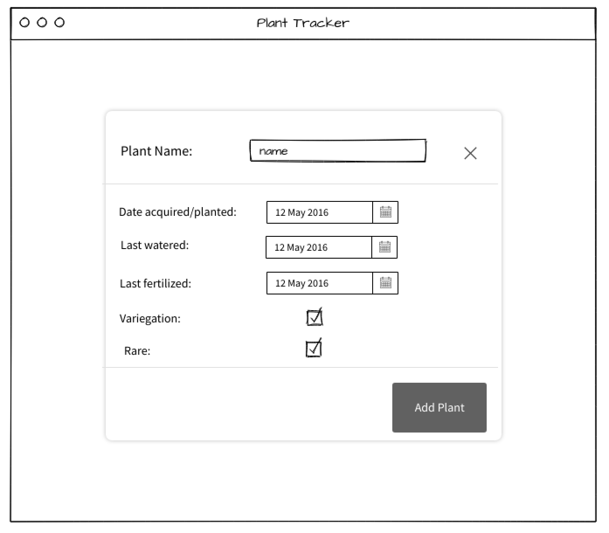
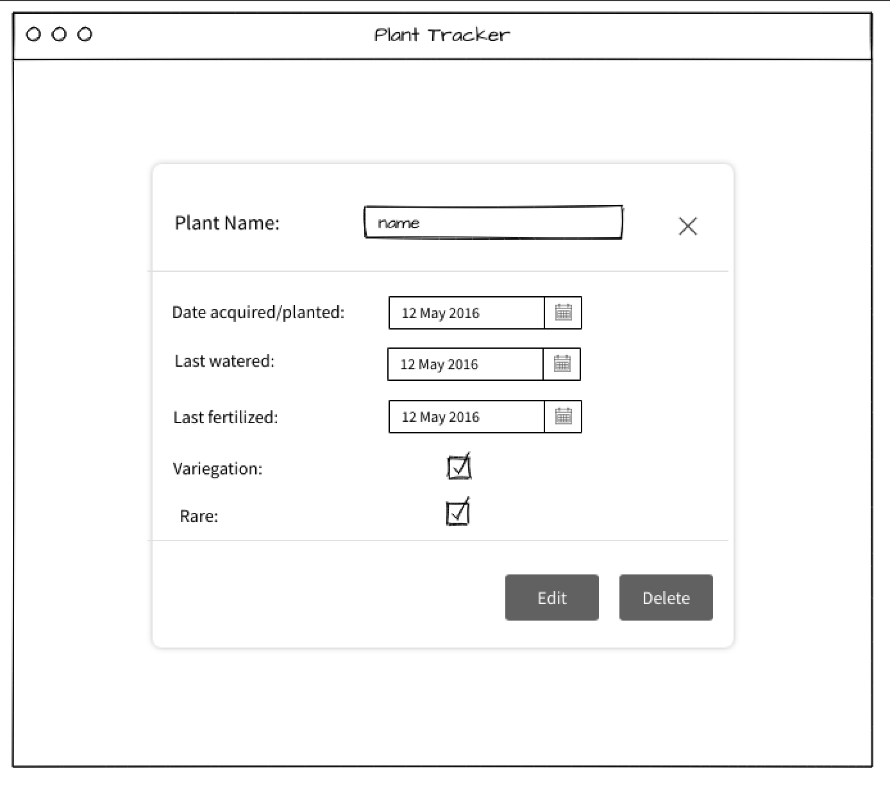
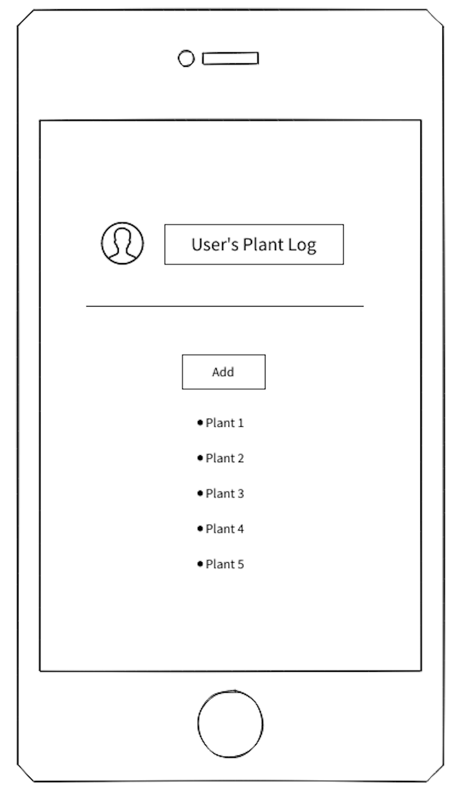
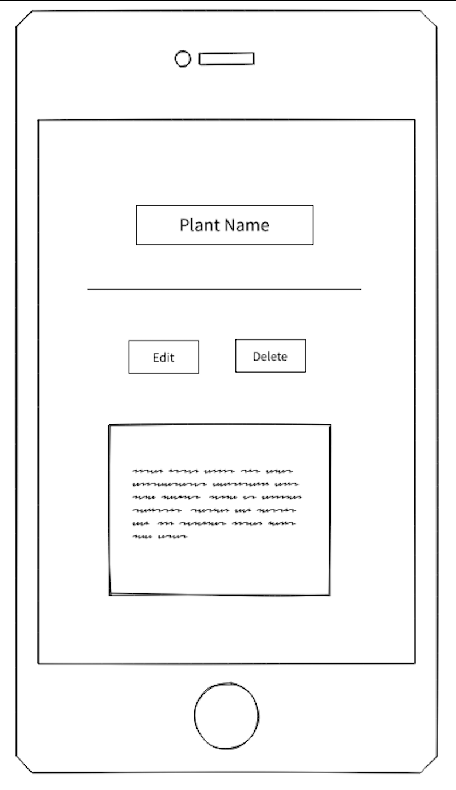
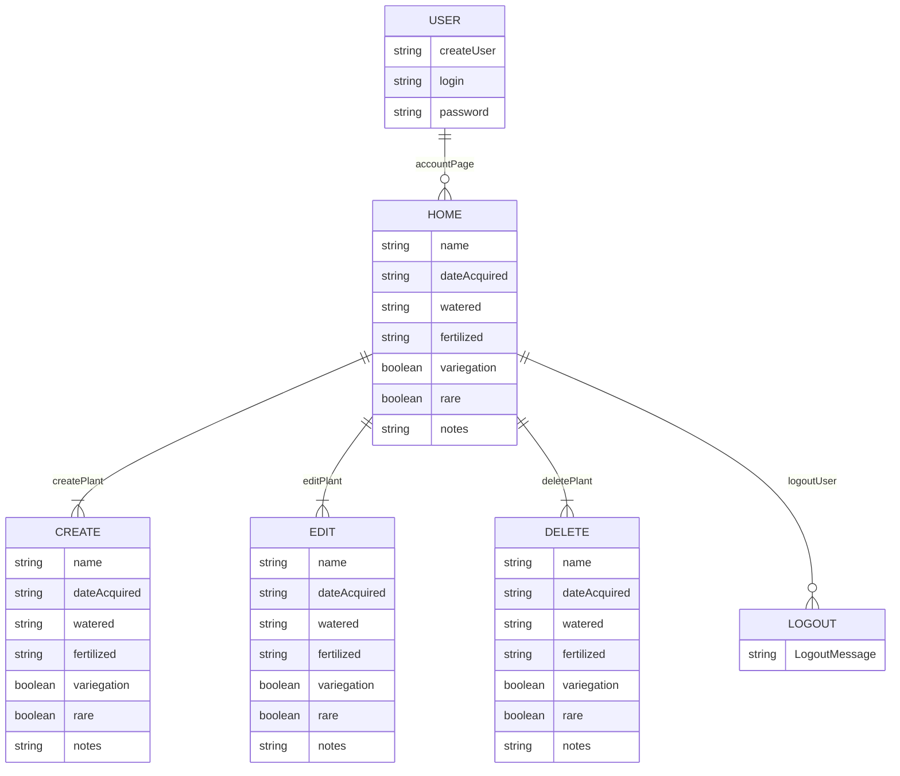

# PROJECT 2
# Plant Tracker 
**By:** Susie Gordon

 

## Description
---
An application used to track and organize a user's planting journey by logging basic plant information and scheduling their specific needs. 

 

## Links
---
- [**GitHub**](https://github.com/choisus08/project_2)
- [**Deployment**](https://project2-cio1.onrender.com)
- [**Trello**](https://trello.com/b/dUkgrfOu/project-1)

 

## Technologies Used 
---
HTML, JS, CSS, Node, Express, EJS, Mongo

 

## UI Mockup
---

**Desktop View**

 

**Mobile View**

 

## Backend Endpoints
---

| Name | ENDPOINT | METHOD | PURPOSE |
|------|----------|--------|---------|
|INDEX| /plant | GET | return list of plants |
| NEW | /plant/new | GET | render page with a form to create new plant; submits to CREATE route |
|DESTROY| /plant/:id | DELETE | delete specified plant from database |
|UPDATE| /plant/:id | PUT | receive info & update specified plant in database |
|CREATE| /plant | POST | receive info from new form & create new plant in database |
|EDIT| /plant/:id/edit | GET | render page with a form to edit specified plant; submits to UPDATE route |
|SHOW| /plant/:id | GET | render page with the specified plant |

 

## ERD (Entity Relationship Diagram)
---

